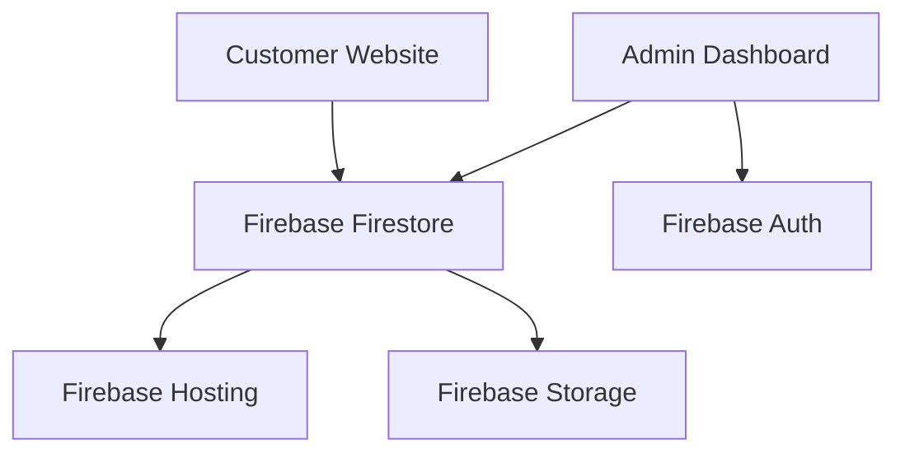

# 🧁 Bakery Web Project

A comprehensive Nuxt3 monorepo solution for bakery businesses, featuring a customer-facing website and administrative management system powered by Firebase.

## 📋 Table of Contents

- [Overview](#overview)
- [Architecture](#architecture)
- [Features](#features)
- [Tech Stack](#tech-stack)
- [Project Structure](#project-structure)
- [Getting Started](#getting-started)
- [Development](#development)
- [Deployment](#deployment)
- [API Reference](#api-reference)
- [Security](#security)
- [Contributing](#contributing)
- [Troubleshooting](#troubleshooting)

## 🌟 Overview

This project provides a complete digital solution for bakery businesses, consisting of two main applications:

- **Bakery Public**: A beautiful, responsive customer website showcasing products and services
- **Bakery Admin**: A powerful administrative dashboard for managing inventory, orders, and content

Built with modern web technologies and designed for scalability, performance, and ease of use.

## 🏗 Architecture

### High-Level Architecture



### Application Flow

- **Public App**: Read-only access to product data via Firestore security rules
- **Admin App**: Authenticated CRUD operations for complete data management
- **Shared Configs**: Common utilities, types, and Firebase configuration

## ✨ Features

### 🛒 Bakery Public (Customer Website)

- **Product Catalog**
  - Browse bakery items with high-quality images
  - Filter and search functionality
  - Detailed product descriptions and pricing

- **Cake Gallery**
  - Custom cake designs showcase
  - Category-based browsing
  - Special occasion collections

- **Business Information**
  - Store location and contact details
  - Operating hours and delivery areas
  - About us and team information

- **Customer Features**
  - Contact forms and inquiries
  - Special order requests
  - Newsletter subscription
  - Social media integration

### 🔧 Bakery Admin (Management Dashboard)

- **Product Management**
  - Add, edit, and delete bakery items
  - Image upload and management
  - Inventory tracking
  - Price and availability management

- **Order Management**
  - Process custom cake orders
  - Track order status and delivery
  - Customer communication tools
  - Order history and analytics

- **Content Management**
  - Update website content
  - Manage promotional banners
  - Blog/news post management
  - SEO optimization tools

- **Analytics & Reporting**
  - Sales performance metrics
  - Popular products analysis
  - Customer engagement data
  - Revenue tracking

## 🛠 Tech Stack

### Frontend
- **Nuxt3** - Vue.js framework with SSR/SSG capabilities
- **Vue 3** - Progressive JavaScript framework
- **TypeScript** - Type-safe JavaScript
- **Tailwind CSS** - Utility-first CSS framework (optional)
- **Pinia** - State management (if needed)

### Backend & Services
- **Firebase Firestore** - NoSQL document database
- **Firebase Authentication** - User authentication system
- **Firebase Storage** - File storage for images
- **Cloudflare Pages** - Web hosting platform with auto-deployment
- **Firebase Functions** - Serverless functions (if needed)

### Development Tools
- **Vite** - Fast build tool (integrated with Nuxt3)
- **ESLint** - Code linting
- **Prettier** - Code formatting
- **Vue DevTools** - Vue.js debugging

## 📁 Project Structure

```
D:\Web_project\Bakery-web\
├── 📁 bakery-public/              # Customer website
│   ├── 📁 app/                    # Nuxt3 app directory
│   │   ├── 📁 components/         # Vue components
│   │   ├── 📁 composables/        # Reusable composition functions
│   │   ├── 📁 layouts/            # Page layouts
│   │   ├── 📁 middleware/         # Route middleware
│   │   ├── 📁 pages/              # Application pages
│   │   ├── 📁 plugins/            # Nuxt plugins
│   │   └── 📁 types/              # TypeScript definitions
│   ├── 📁 assets/                 # Static assets
│   ├── 📁 public/                 # Public files
│   ├── 📁 server/                 # Server-side code
│   ├── 📄 nuxt.config.ts          # Nuxt configuration
│   ├── 📄 package.json            # Dependencies
│   └── 📄 tsconfig.json           # TypeScript config
│
├── 📁 bakery-admin/               # Admin dashboard
│   ├── 📁 app/                    # Nuxt3 app directory
│   │   ├── 📁 components/         # Admin components
│   │   ├── 📁 composables/        # Admin composables
│   │   ├── 📁 layouts/            # Admin layouts
│   │   ├── 📁 middleware/         # Auth middleware
│   │   ├── 📁 pages/              # Admin pages
│   │   ├── 📁 plugins/            # Admin plugins
│   │   └── 📁 types/              # Admin type definitions
│   ├── 📁 assets/                 # Admin assets
│   ├── 📁 public/                 # Admin public files
│   ├── 📁 server/                 # Admin server code
│   ├── 📄 nuxt.config.ts          # Admin Nuxt config
│   ├── 📄 package.json            # Admin dependencies
│   └── 📄 tsconfig.json           # Admin TypeScript config
│
├── 📁 shared-configs/             # Shared configurations
│   ├── 📁 types/                  # Shared TypeScript types
│   ├── 📁 utils/                  # Shared utility functions
│   ├── 📄 firebase.config.ts      # Firebase configuration
│   └── 📄 firestore.rules         # Firestore security rules
│
├── 📄 package.json                # Root package.json
├── 📄 firebase.json               # Firebase project config
├── 📄 .firebaserc                 # Firebase projects config
├── 📄 README.md                   # Project documentation
└── 📄 CLAUDE.md                   # Claude Code context
```

## 🚀 Getting Started

### Prerequisites

- **Node.js** (v18 or later)
- **npm** or **yarn**
- **Firebase CLI**
- **Git**

### Installation

1. **Clone the repository**
   ```bash
   git clone <repository-url>
   cd Bakery-web
   ```

2. **Install dependencies**
   ```bash
   # Install root dependencies
   npm install
   
   # Install public app dependencies
   cd bakery-public
   npm install
   
   # Install admin app dependencies
   cd ../bakery-admin
   npm install
   ```

3. **Firebase Setup**
   ```bash
   # Install Firebase CLI globally
   npm install -g firebase-tools
   
   # Login to Firebase
   firebase login
   
   # Check available projects
   firebase projects:list
   
   # Set up Firebase project
   firebase use --add
   ```

4. **Environment Configuration**
   ```bash
   # Create environment files
   cp bakery-public/.env.example bakery-public/.env
   cp bakery-admin/.env.example bakery-admin/.env
   ```

5. **Firebase Configuration**
   ```bash
   # Initialize Firebase (if not already done)
   firebase init
   
   # Select:
   # - Firestore
   # - Hosting
   # - Storage (optional)
   # - Functions (optional)
   ```

## 💻 Development

### Development Commands

```bash
# Start public website development server
npm run dev:public

# Start admin dashboard development server  
npm run dev:admin

# Start both applications simultaneously
npm run dev

# Build applications
npm run build:public
npm run build:admin

# Type checking
npx vue-tsc --noEmit

# Linting
npm run lint

# Security audit
npm audit
```

### Development Workflow

1. **Feature Development**
   ```bash
   git checkout -b feature/new-feature
   # Develop your feature
   npm run dev:public  # or dev:admin
   ```

2. **Testing**
   ```bash
   # Type checking
   npx vue-tsc --noEmit
   
   # Build test
   npm run build:public
   npm run build:admin
   ```

3. **Code Quality**
   ```bash
   # Lint code
   npm run lint
   
   # Format code
   npm run format
   ```

### Firebase Emulators (Optional)

```bash
# Start Firebase emulators
firebase emulators:start

# Available emulators:
# - Firestore: http://localhost:8080
# - Auth: http://localhost:9099
# - Storage: http://localhost:9199
```

## 🚀 Deployment

### Cloudflare Pages - Auto-Deployment

This project uses **automatic deployment** via GitHub Actions. Every push to the `main` branch triggers deployment to Cloudflare Pages.

**Live URLs:**
- **Public Site**: https://bakery-public.pages.dev
- **Admin Panel**: https://bakery-admin.pages.dev

### How Auto-Deploy Works

1. Push changes to `main` branch
2. GitHub Actions workflow (`.github/workflows/cloudflare-pages.yml`) automatically triggers
3. Both applications build in parallel
4. Deploy to Cloudflare Pages
5. Live in 2-3 minutes!

### Setup Auto-Deploy

See **CLOUDFLARE_AUTO_DEPLOY.md** for detailed setup instructions.

Quick setup:
1. Create Cloudflare API token
2. Add `CLOUDFLARE_API_TOKEN` to GitHub Secrets
3. Push to `main` branch

### Manual Deployment (if needed)

```bash
# Build both applications
npm run build:all

# Deploy using Wrangler CLI
cd bakery-public
npx wrangler pages deploy .output/public --project-name=bakery-public

cd ../bakery-admin
npx wrangler pages deploy .output/public --project-name=bakery-admin
```

### Deploy Firestore Rules

```bash
# Deploy database rules and indexes
npm run deploy:firestore
```

### Production Deployment Checklist

- [ ] `CLOUDFLARE_API_TOKEN` added to GitHub Secrets
- [ ] Environment variables configured (if needed)
- [ ] Firestore security rules updated
- [ ] TypeScript compilation successful
- [ ] GitHub Actions workflow passing
- [ ] Custom domain configured (optional)
- [ ] SSL automatically managed by Cloudflare

## 📡 API Reference

### Firestore Collections

#### Products Collection
```typescript
interface Product {
  id: string;
  name: string;
  description: string;
  price: number;
  category: 'cakes' | 'pastries' | 'bread' | 'desserts';
  images: string[];
  available: boolean;
  createdAt: Timestamp;
  updatedAt: Timestamp;
}
```

#### Orders Collection
```typescript
interface Order {
  id: string;
  customerId: string;
  items: OrderItem[];
  totalAmount: number;
  status: 'pending' | 'confirmed' | 'in-progress' | 'completed' | 'cancelled';
  deliveryDate: Timestamp;
  customerInfo: CustomerInfo;
  specialInstructions?: string;
  createdAt: Timestamp;
  updatedAt: Timestamp;
}
```

### API Endpoints (Server Routes)

#### Public API
- `GET /api/products` - Get all products
- `GET /api/products/:id` - Get product by ID
- `GET /api/categories` - Get product categories
- `POST /api/contact` - Submit contact form

#### Admin API (Authenticated)
- `POST /api/admin/products` - Create product
- `PUT /api/admin/products/:id` - Update product
- `DELETE /api/admin/products/:id` - Delete product
- `GET /api/admin/orders` - Get all orders
- `PUT /api/admin/orders/:id` - Update order status

## 🔒 Security

### Firestore Security Rules

#### Public Read Access
```javascript
// Allow read access to products for everyone
match /products/{productId} {
  allow read: if true;
  allow write: if request.auth != null && 
    request.auth.token.admin == true;
}
```

#### Admin Write Access
```javascript
// Admin-only write access
match /orders/{orderId} {
  allow read, write: if request.auth != null && 
    request.auth.token.admin == true;
}
```

### Authentication Flow

1. **Admin Login**
   - Firebase Auth with email/password
   - Custom claims for admin role
   - Session management

2. **Route Protection**
   - Middleware for admin routes
   - Authentication state management
   - Automatic redirects

### Best Practices

- Never expose Firebase admin SDK keys in client code
- Use environment variables for sensitive configuration
- Implement proper input validation
- Regular security audits with `npm audit`
- Keep dependencies updated

## 🤝 Contributing

### Development Guidelines

1. **Code Style**
   - Use TypeScript for type safety
   - Follow Vue 3 Composition API patterns
   - Use Nuxt3 auto-import features
   - Consistent naming conventions

2. **Git Workflow**
   ```bash
   # Feature branch
   git checkout -b feature/feature-name
   
   # Commit with descriptive messages
   git commit -m "feat: add product search functionality"
   
   # Push and create PR
   git push origin feature/feature-name
   ```

3. **Pull Request Process**
   - Ensure TypeScript compilation passes
   - Test both public and admin applications
   - Update documentation if needed
   - Request code review

### Code Standards

- **Components**: PascalCase naming
- **Composables**: camelCase with `use` prefix
- **Constants**: UPPER_SNAKE_CASE
- **Files**: kebab-case for pages, PascalCase for components

## 🐛 Troubleshooting

### Common Issues

#### Build Errors
```bash
# TypeScript errors
npx vue-tsc --noEmit

# Clear cache and reinstall
rm -rf node_modules package-lock.json
npm install
```

#### Firebase Connection Issues
```bash
# Check Firebase project
firebase projects:list

# Verify authentication
firebase login --reauth

# Check configuration
firebase use --add
```

#### Development Server Issues
```bash
# Clear Nuxt cache
rm -rf .nuxt .output

# Restart development server
npm run dev:public
```

### Debug Commands

```bash
# Find specific strings in codebase
findstr /s /i "search_term" *.js *.ts *.vue

# Check Firebase CLI version
firebase --version

# Verify project structure
tree /f /a
```

### Performance Optimization

- **Images**: Optimize and use appropriate formats (WebP)
- **Bundle Size**: Analyze with Nuxt bundle analyzer
- **Caching**: Implement proper caching strategies
- **SEO**: Use Nuxt SEO module for optimization

## 📚 Additional Resources

- [Nuxt3 Documentation](https://nuxt.com/)
- [Firebase Documentation](https://firebase.google.com/docs)
- [Vue 3 Documentation](https://vuejs.org/)
- [TypeScript Documentation](https://www.typescriptlang.org/)

## 📄 License

This project is licensed under the MIT License - see the [LICENSE.md](LICENSE.md) file for details.

## 👥 Team

- **Frontend Development**: Vue.js/Nuxt3 specialists
- **Backend Integration**: Firebase experts
- **UI/UX Design**: User experience designers
- **DevOps**: Deployment and infrastructure

---

**Happy Baking! 🧁✨**

For support and questions, please create an issue in the project repository.